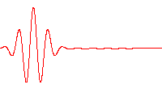

class: center, middle

# Numerical solution for Schrodinger equation

---

# Agenda

1. Introduction to Schrodinger Equation

--
2. Biomedical applications for S.E

--
3. Different approaches to solve the S.E

---

# Introduction to Schrodinger Equation

Erwin Schrodinger derived the equation in 1925, he was trying to come up with an equation to explain the motion of particles in the Quantum Realm.

--

In his first paper he published, he was trying to explain and show mathematically the quantization of energy in different boundary states.

--

- In the later advancements of his work he invoked ***Complex Numbers*** in the *Wave Mechanics*

---

# Breaking apart S.E

To understand Schrodinger equation we first need to go back to the basics of energy:
    
--

- The total energy of any particle is its Kinetic energy + its Potential Energy

--

- The Potential Energy results interacting with the environment and it's denoted to by $ V(r,t) $

--

- The Kinetic Energy is an internal property; its inertia AKA momentum.

--

We'll see the form of the Kinetic energy.

---

The K.E in terms of momentum :

$$
E = \int F \cdot \mathbf{d}x = \int \frac{\mathbf{d}p}{\mathbf{d}t} \cdot \upsilon \mathbf{d}t 
$$
$$
E = \int_{0}^{p} \frac{p}{m} \cdot \mathbf{d}p = \frac{p^2}{2m} 
$$

--

So now we have known how represent the K.E in terms of momentum

we need to show the momentum operator

$$
\hat{p} = -\imath \hbar \nabla
$$

--

We can show it works and proof it is  the momentum operator

Is we have $\psi (\vec{r},t)$

$$
\psi (r,t) = e^{ \frac{i}{\hbar} ( p\vec{r} - Et)}
$$

--

If we apply the momentum operator on $\psi(\vec{r}, t)$ we'll get the momentum

$$
\hat{p} \cdot \psi (\vec{r}, t) = p \psi (\vec{r}, t)
$$

Thus this proves that $\hat{p} = -\imath \hbar \nabla$ is the momentum operator

---

# We need to put it back together

Total energy $\hat{\mathcal{H}} = \hat{\mathcal{T}} + \hat{\mathcal{V}}$

- $\hat{\mathcal{H}} \rightarrow$ Hamiltonian operator

- $\hat{\mathcal{T}} \rightarrow$ Kinetix energy  , $\hat{\mathcal{V}} \rightarrow$ Potential energy

--

$$\hat{\mathcal{T}} = \frac{\hat{p} \cdot \hat{p}}{2m} = \frac{-\hbar^2 \nabla^2}{2m}$$

--

$$\hat{\mathcal{V}} = \mathcal{V}(\vec{r},t)$$

--

**So**
$$
\hat{\mathcal{H}} = \frac{-\hbar^2 \nabla^2}{2m} + \mathcal{V}(\vec{r},t)
$$

---

# The last piece of the equation

Energy is Plank's constant X frequency $E = \mathit{h}\mu$

--

Building on that

$$\imath \hbar \frac{\partial}{\partial t}$$

--

Also if $\psi (\vec{r},t)$

$$\psi (\vec{r},t) = e^{ \frac{i}{\hbar} ( p\vec{r} - Et)}$$

--

$$\imath \hbar \frac{\partial}{\partial t} \psi (\vec{r},t) = \imath \hbar \frac{\partial}{\partial t} e^{ \frac{i}{\hbar} ( p\vec{r} - Et)} = E$$

--

Since :

$\hat{\mathcal{H}}\cdot \psi(\vec{r},t) = E$

**Therfore**:
$$
\imath \hbar \frac{\partial}{\partial t} \psi (\vec{r},t) = \hat{\mathcal{H}}\cdot \psi(\vec{r},t)
$$

---

# Finally

**This**
$$
\imath \hbar \frac{\partial}{\partial t} \psi (\vec{r},t) = \left[ \frac{-\hbar}{2\mu} \nabla^2+ \mathcal{V}(\vec{r},t) \right] \psi(\vec{r},t)
$$

--

We just like to write this way, to look smart.

$$
\imath \hbar \frac{\partial}{\partial t} \vert \psi (\vec{r},t)\rangle = \left[ \frac{-\hbar}{2\mu} \nabla^2+ \mathcal{V}(\vec{r},t) \right]\vert \psi(\vec{r},t)\rangle
$$

--

The probability is $\psi^* \cdot \psi$ or in other form $\vert \psi \vert ^2$

---

# Different interpretations of S.E

- This describes the quantum state of a particle bounded by specific potential field :

--

    - Free Particle : $\mathcal{V}(\vec{r},t) = 0$

--

    - Quantum Harmonic Oscillator : $\mathcal{V}(\vec{r},t)$ = $\frac{1}{2} k \hat{x} ^2$

---

<!-- An example for the S.E solution is at potential = 0, simply the free-particle equation

--

$$
\imath \hbar \frac{\partial}{\partial t} \vert \psi (r,t)\rangle = \frac{-\hbar}{2\mu} \nabla^2 \vert \psi(r,t)\rangle 
$$
--

--- -->

# Biomedical applications for S.E

The scientists who work in nanotechnology  use S.E in various applications

1. The motion of electrons in nanotubes

--

    - Basically it describes the particle moving as a wave in the Garphene sheet/tube

--

2. Quantum dots and its light frequencies

--

    - Most probably scientists are more concerned with the discrete energy states the quantum dots

---

# Different approaches to solve it

We will study different approaches to solve it

1. Finite difference
2. Crank-Nicolson Method

---

# Finite element

$\frac{\partial^2}{\partial x ^2} f(\vec{r},t) = \frac{f(\vec{r}+\vec{\Delta r},t)-2*f(\vec{r},t)+f(\vec{r}+\vec{\Delta r},t)}{\Delta r ^2}$

--

We can manifest that this as a matrix in this form:

---

# We are going to use the property of eigen values and vectors

Since: 

$\hat{\mathcal{H}}$ is an Eigen operator which mean When it applies on a function it brings out the eigen value associated with it without changing the function

--

$\hat{\mathcal{H}}\cdot \psi(\vec{r},t) = E \psi(\vec{r},t)$

--

Which means that to solve the right part we can find the eigen values which represent the energy levels and the eigen vector represent the $\psi$

>We are planning to implement the solution using Python

---

---

# References

- [Numerical Solutions of the Schrödinger Equation](../Ref/schrod.pdf )
- [Solving the time-dependent Schrödinger equation using finite difference methods](../Ref/v54n2a3.pdf)
